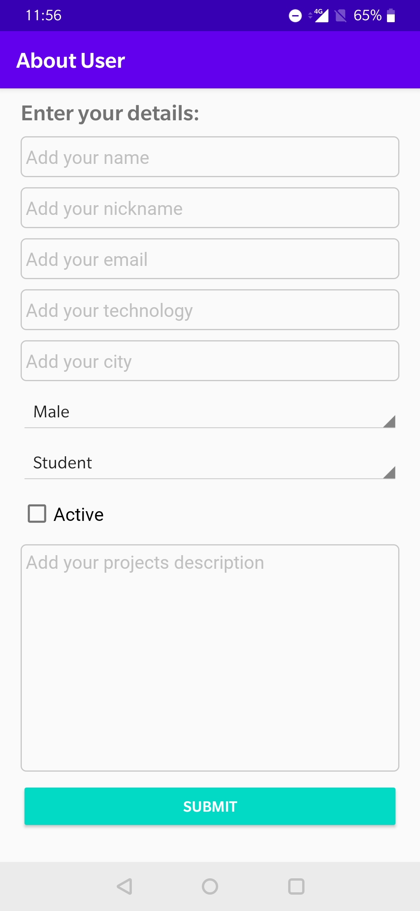
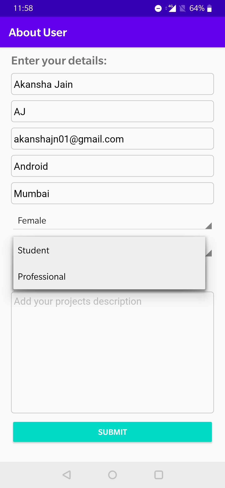
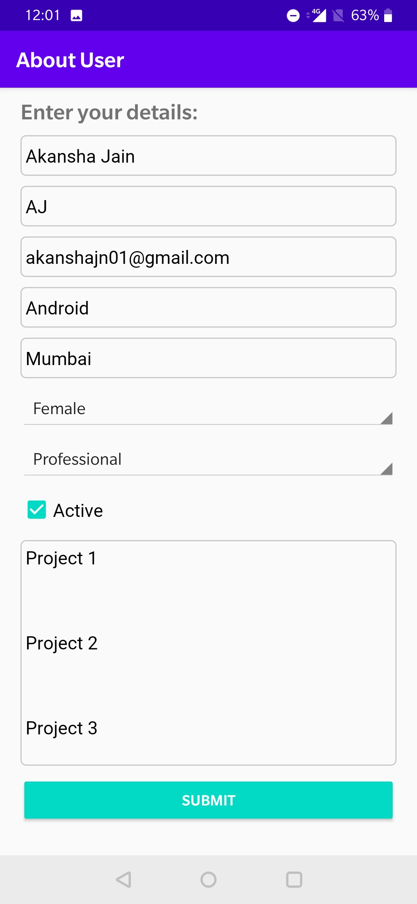
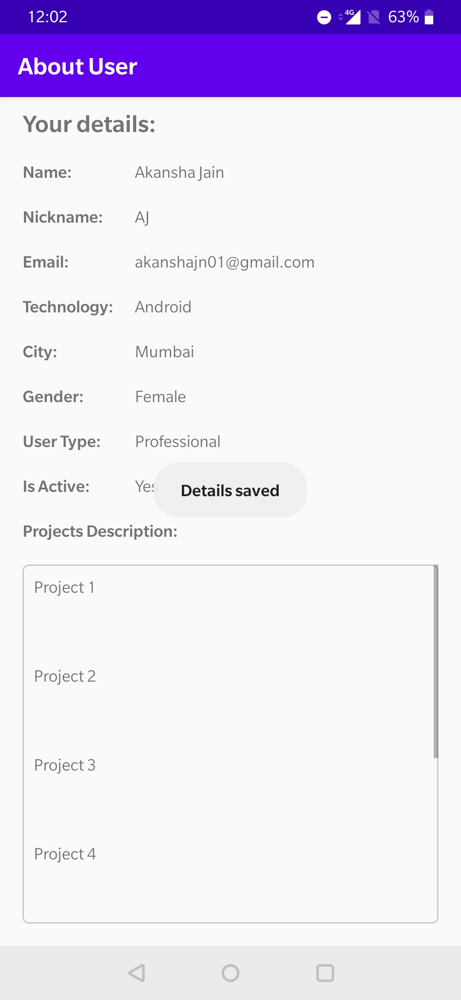
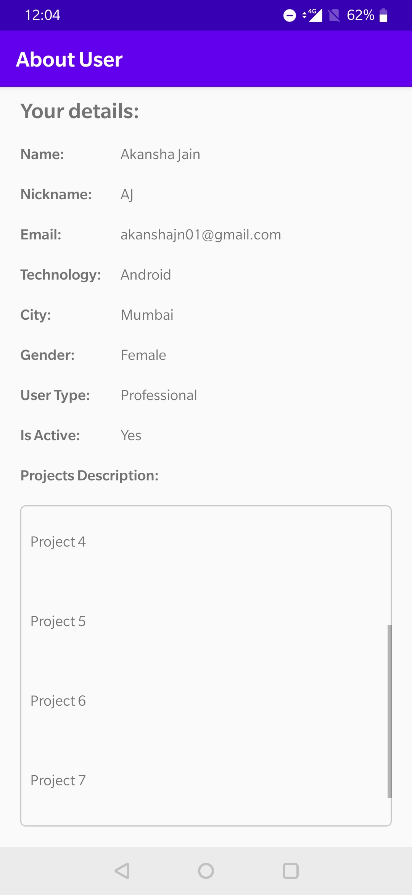

##  Android Application to get and display User details

This application was developed to implement below features

* Data binding for different types of views in a Linear Layout

#### Working

The user will enter the details in various fields. Once done, user will click the Submit button to submit the data. The data entered by the user will be saved in the binding object inside activity. Using data binding in the layout, the details will be displayed to the user. User can scroll to view data for long text field.

&nbsp;&nbsp;&nbsp;&nbsp;&nbsp;&nbsp;&nbsp;&nbsp;&nbsp;&nbsp;&nbsp;&nbsp;
    
&nbsp;&nbsp;&nbsp;&nbsp;&nbsp;&nbsp;
