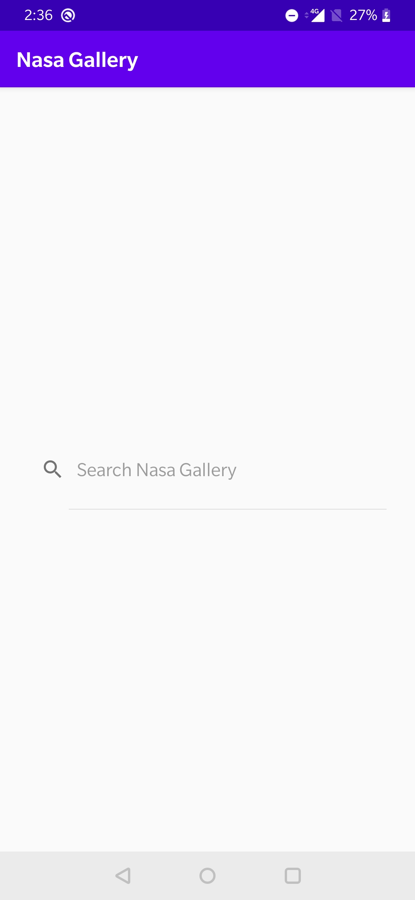
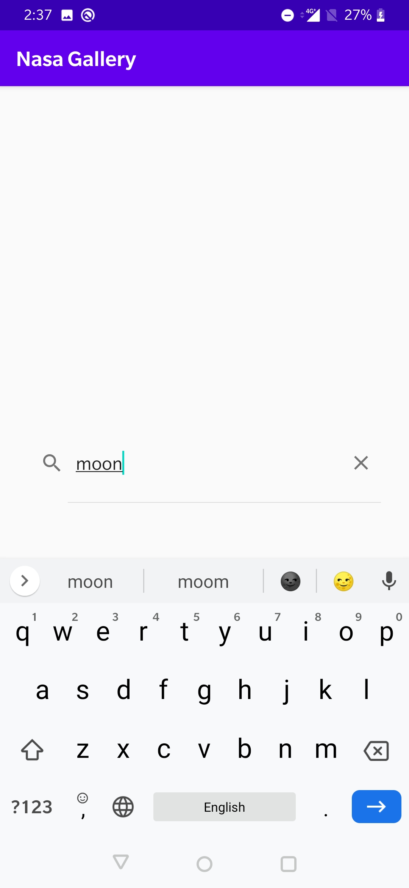
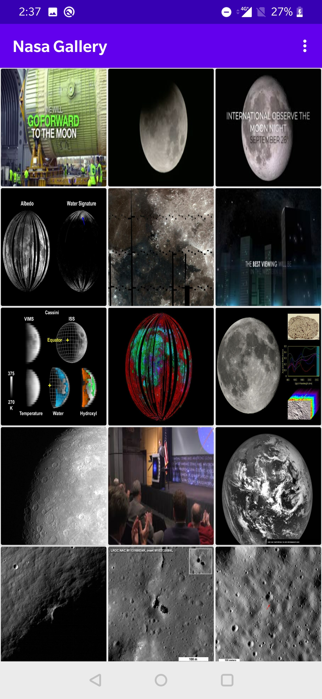
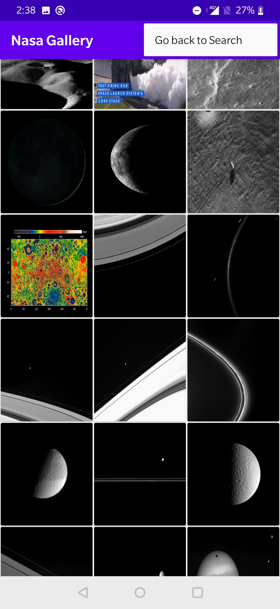
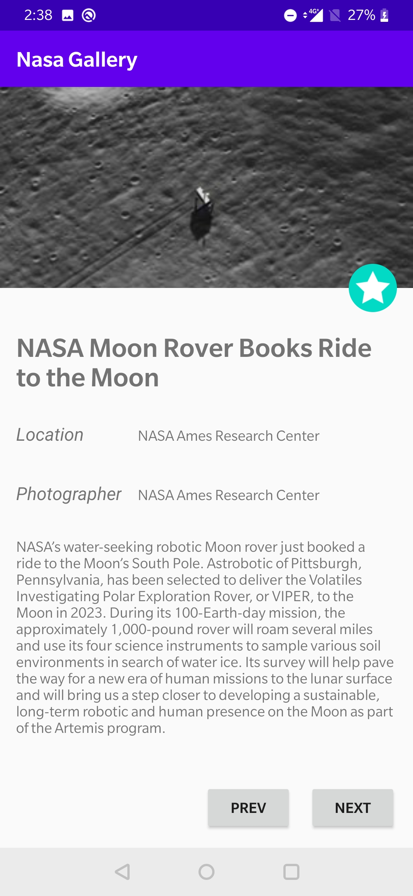

##  Android Application to search Nasa Gallery and view Image details

This application was developed to implement below features

* Fetch data from the internet (Nasa Api)
* Recycler View with Grid Layout to display images
* Design a details page using Constraint Layout

#### Working

The user will enter a search value on the Search page. Images for that search value will be fetched using Nasa Api and displayed in Recycler View Grid.The user can go back to Search page to search another value. On clicking any image in the grid, the user can see the details of that image. The details page is only a design. All views in the details page are placed using different types of constraints. 

&nbsp;&nbsp;&nbsp;&nbsp;&nbsp;&nbsp;&nbsp;&nbsp;&nbsp;&nbsp;&nbsp;&nbsp;

    
&nbsp;&nbsp;&nbsp;&nbsp;&nbsp;&nbsp;
